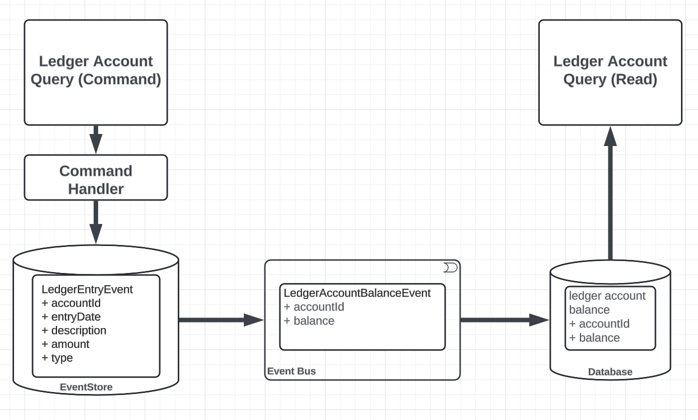
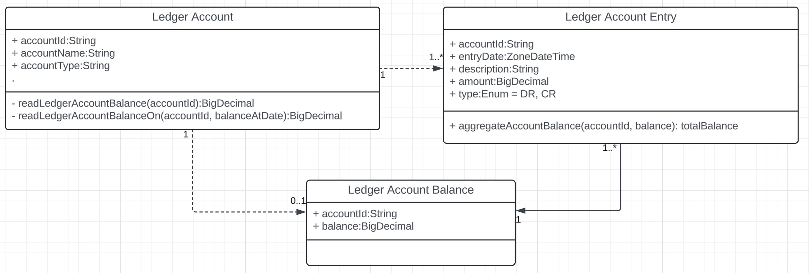
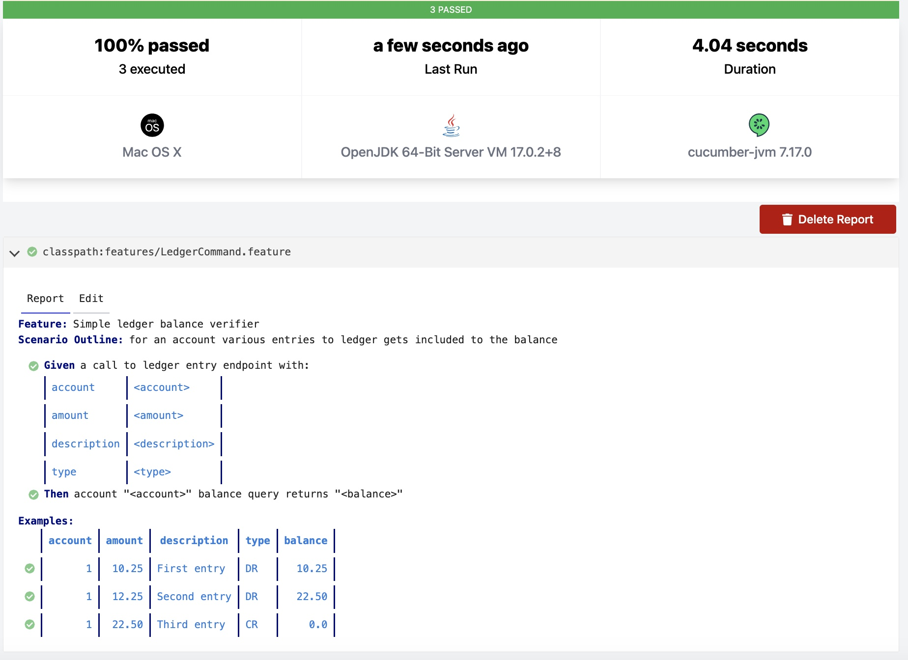
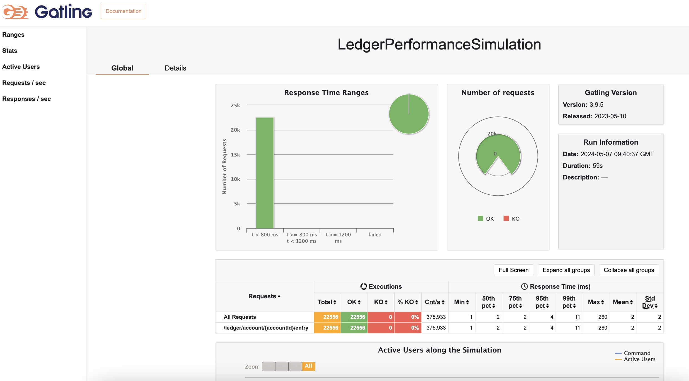

# Ledger System

## Tech Stack

* Java 17
* Spring Boot
* Axon Server
* H2 in memory DB

## Architecture Diagram

This initial version is a much simplified version of the intended architecture, [command](src/command)
and [query](src/query) sourceSets needs to be developed to be individually deployable/scalable artifacts.

## Initial Domain model (WIP)

## Local execution

### Application

Execute `./scripts/app.sh` in terminal from the root of the project.

### Integration tests

Make sure application is running as described above.

Execute `./scripts/int.sh` in terminal from the root of the project.

### Performance tests

Make sure application is running as described above.

Execute `./scripts/perf.sh` in terminal from the root of the project.

